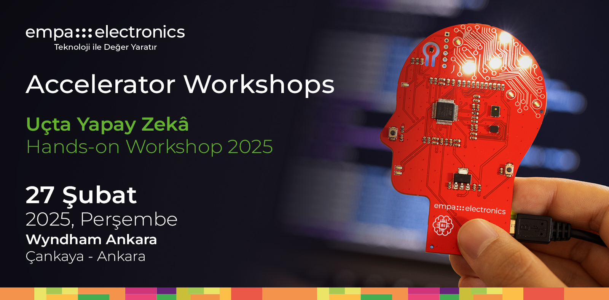

<p align="center">
    
</p>


## Accelerator Workshops'a hoş geldiniz!

**Merhaba!**

Empa Electronics tarafından düzenlenen Accelerators Workshops etkinliğimize hoş geldiniz. Bu açık-kaynaklı repository, workshop etkiliğimizde kullanabileceğiniz tüm gereksinimleri edinebilmeniz ve aktivitelere kolaylıkla eşlik edebilmeniz için sizinle paylaşılmıştır.

**Uçta Yapay Zeka**  
Bir uygulama için geliştirilen yapay zeka çözümlerinin işletilmesi modern sistemlerde iki farklı türde yapılabilmektedir. Bunlardan biri olan bulutta yapay zeka, bir yapay zeka modelinin bulut sunucu üzerinde (örneğin AWS/Azure gibi platformlarda) tesisi ve bu modele gönderilen veri örnekleri için alınan tahminlerin tekrar göndericiye iletilmesi usulüyle çalışmaktadır. Bir diğer alternatif olan uçta yapay zeka, bir modelin doğrudan çözüm için kullanılan bir uç birimde (_edge device_, örneğin: sensör kartı) tesis edilmesi ve girdi veriler için elde edilen tahminlerin doğrudan aynı platform üzerinde elde edilebilmesidir. Uçta yapay zeka çözümleri, verinin tahminleme için başka bir platforma gönderilmemesi sayesinde başta düşük gecikme, düşük bant genişliği, düşük güç tüketimi ve veri gizliliği gibi pek çok fayda sağlamaktadır.

## Canlı Demo
Uçta Yapay Zeka workshop etkinliğimizde gerçekleştirilecek canlı demo gösterimine katılım için herhangi bir kurulum ihtiyacı yoktur. Demo kaynak dosyaları, uygulama içeriklerinin incelenmesi ve etkinlik sonrası referans materyal olarak kullanımı amacıyla paylaşılmaktadır.

### ↳ [1) Vitis-AI ile FPGA Platformlarında AI Uygulamaları Geliştirme](Activity1_AI_Solution_with_Vitis-AI)
Yapay zeka çözümlerinin FPGA tabanlı AMD platformlarında kullanımının uygulamalı anlatımını içerir. Bu aktivite, interaktif olarak yapılmayacak olup yalnızca konuşmacıların uygulamalı anlatımı içerir. Aktivite kaynağı olarak sağlanan içerikler, etkinlik sonrası deneyimleme amaçlıdır.

## Çalıştay Aktiviteleri
Uçta Yapay Zeka workshop etkinliğimizde gerçekleştirilecek aktivitelerde kullanılacak çalışma ortamları ve gerekli kurulumlar için sırasıyla her bir aktivite için oluşturulan kurulum kılavuzlarına giderek gerekli adımları uygulayınız. 

### ↳ [2) ST MCU Platfromları İçin Edge-AI Çözümleri Geliştirme](Activity2_Bare-Metal_Edge-AI_Solution)
Çoğunluğu Tiny-ML konseptine uygun "uçta yapay zeka" uygulamalarının ST Microelectronics ürünleri üzerinde çözümleştirilmesine yönelik uygulamalı anlatımı içerir. Bu aktivite, kullanıcıların katılımıyla interaktif olarak gerçekleştirilecektir.
### ↳ [3) NanoEdge AI Studio ile Edge-AI Çözümleri Geliştirme](Activity3_NEAIS_for_Edge-AI_Deployment)
Tiny-ML uygulamaları geliştirmede güçlü bir alternatif oluşturan NanoEdge AI Studio ile uçta yapay zeka uygulamaları geliştirme adımlarını içerir. Bu aktivite, kullanıcıların katılımıyla interaktif olarak gerçekleştirilecektir.

## Dizin Yapısı

Repository içerisindeki her bir klasör, etkinliğimizde yer alacak bir yapay zeka çözümü uygulamasına ait çalışma ortamlarını ve gerekli kurulumları içermektedir.

```
Workshop Repository
├── Activity1_AI_Solution_with_Vitis-AI
│   ├── Kaynak Kod & Materyaller
│   └── README.md (Aktivite-1 Kılavuzu)
├── Activity2_Bare-Metal_Edge-AI_Solution
│   ├── Kaynak Kod & Materyaller
│   └── README.md (Aktivite-2 Kılavuzu)  
└── Activity3_NEAIS_for_Edge-AI_Deployment
    ├── Kaynak Kod & Materyaller
    └── README.md (Aktivite-3 Kılavuzu) 
```

## Ön Gereksinimler - Checklist
Workshop etkiliğinde kullanılacak çalışma ortamlarının kurulumları sonrası hazırladığımız checklist ile gereksinimlerin kontrolünü sağlayabilirsiniz.

**Aktivite-1  (_Etkinlik Sonrası Deneysel Kullanım Amaçlıdır_)**
- [ ] Python3.8
- [ ] Docker
- [ ] Vitis-AI Docker Container Ortamı
- [ ] Aktivite-1 Kaynak Dosyaları

**Aktivite-2**
- [ ] Colab Notebook Örneği (Kurulum Gerektirmez)
- [ ] STM32CubeIDE (STM32CubeMX & STM32CubeAI)
- [ ] STM32CubeProgrammer
- [ ] Aktivite-2 Kaynak Dosyaları

**Aktivite-3**
- [ ] NanoEdge AI Studio
- [ ] STM32CubeIDE (STM32CubeMX)
- [ ] STM32CubeProgrammer
- [ ] Aktivite-3 Kaynak Dosyaları

## Güncellemeler
Workshop etkinliğimizde gerekli çalışma ortamları üzerindeki güncellemeleri bu başlık altında takip edebilirsiniz.
```
Versiyon-1: 12 Şubat 2025  
Tüm aktiviteler için temel bileşenleri içeren kılavuzlar repository içerisinde paylaşıldı.
```

## Uyarılar

Aktivite çalışma ortamlarının kurulumlarıyla ilgili soru ve taleplerinizi **ai@empa.com** adresine iletebilirsiniz.

Workshop aktiviteleri için sağlanan çalışma ortamlarının son hallerini edinmek için Güncellemeler başlığını kontrol ediniz. Kurulumlarını bitirmiş olduğunuz çalışma ortamınıza mevcut güncellemeleri eklemek için terminalinizde AI_Workshop klasörünü açınız ve "git pull" komutu ile güncellemeleri ekleyiniz:
```
cd Workshop_Workspace/Accelerator-Workshop-EdgeAI
git pull origin master
```